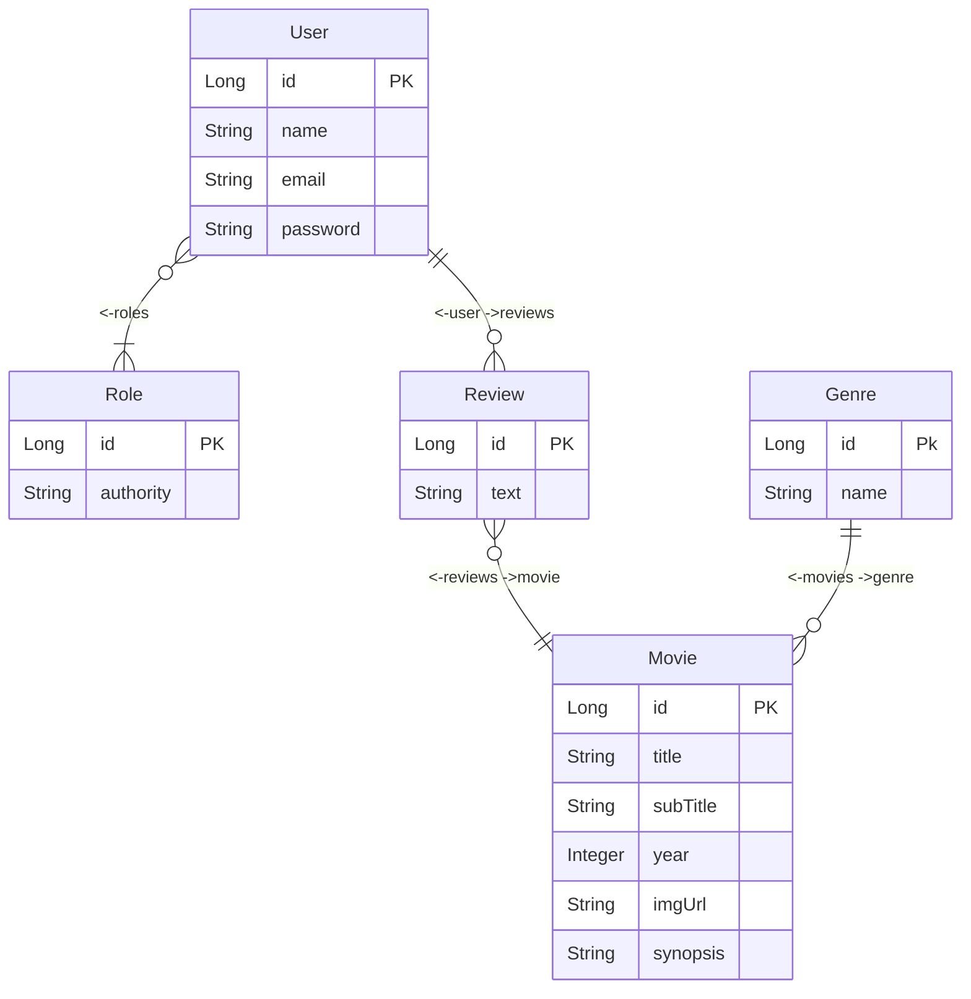

# DESAFIO MOVIE FLIX
📍 CURSO DEVSUPERIOR / JAVA SPRING EXPERT 
📅 16 de novembro de 2023 - 🚩 São Paulo, Brazil - 😁 Mauricio Mityo Hidani 

## Diagrama Entidade Relacionamento:

## Casos de uso

### Listar filmes
1. [OUT] O sistema apresenta uma listagem dos nomes de todos gêneros, bem como
   uma listagem paginada com título, subtítulo, ano e imagem dos filmes, ordenada
   alfabeticamente por título.
2. [IN] O usuário visitante ou membro seleciona, opcionalmente, um gênero.
3. [OUT] O sistema apresenta a listagem atualizada, restringindo somente ao gênero
   selecionado.

### Visualizar detalhes do filme
1. [IN] O usuário visitante ou membro seleciona um filmehttps://devsuperior.com.br
2. [OUT] O sistema informa título, subtítulo, ano, imagem e sinopse do filme, e também
   uma listagem dos textos das avaliações daquele filme juntamente com nome do usuário
   que fez cada avaliação.
3. [IN] O usuário membro informa, opcionalmente, um texto para avaliação do filme.
   3.1.1. **Exceção 3.1 - Texto vazio:** O sistema apresenta uma mensagem de que não é permitido texto vazio na
   avaliação
4. [OUT] O sistema apresenta os dados atualizados, já aparecendo também a avaliação
   feita pelo usuário.

## Documentação POSTMAN
[Documentação](https://documenter.getpostman.com/view/11829765/2s9YXpWKMk) : https://documenter.getpostman.com/view/11829765/2s9YXpWKMk

## Endpoints / Rotas (LOCALHOST) - REST API

### Autenticação:
- **[POST] log in:** [http://localhost:8080/oauth2/token](http://localhost:8080/oauth2/token)

### Movie:
- **[GET] find by id:** [http://localhost:8080/movies/1](http://localhost:8080/movies/1)
- **[GET] find by id with reviews:** [http://localhost:8080/movies/1/reviews](http://localhost:8080/movies/1/reviews)
- **[GET] find by genre id:** [http://localhost:8080/movies?genreId=0&page=0&size=6](http://localhost:8080/movies?genreId=0&page=0&size=6)

### Genres:
- **[GET] find all:** [http://localhost:8080/genres](http://localhost:8080/genres)

### Reviews:
- **[POST] new review:** [http://localhost:8080/reviews](http://localhost:8080/reviews)

### User:
- **[GET] get logged:** [http://localhost:8080/users/profile](http://localhost:8080/users/profile)